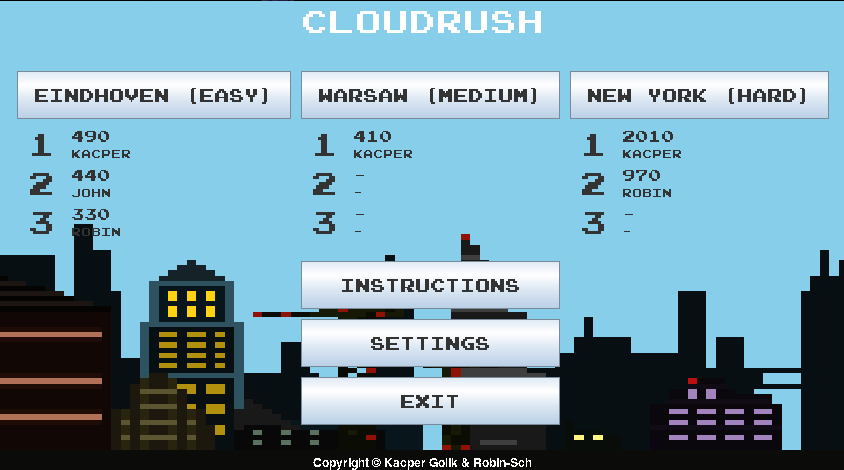
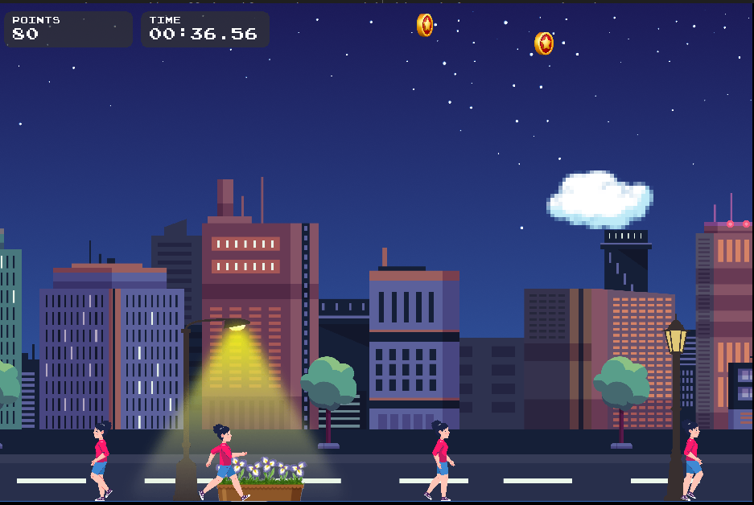
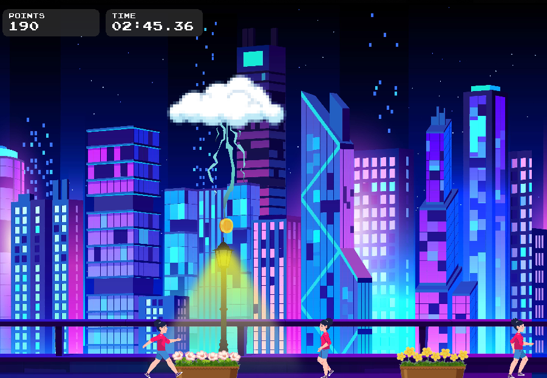
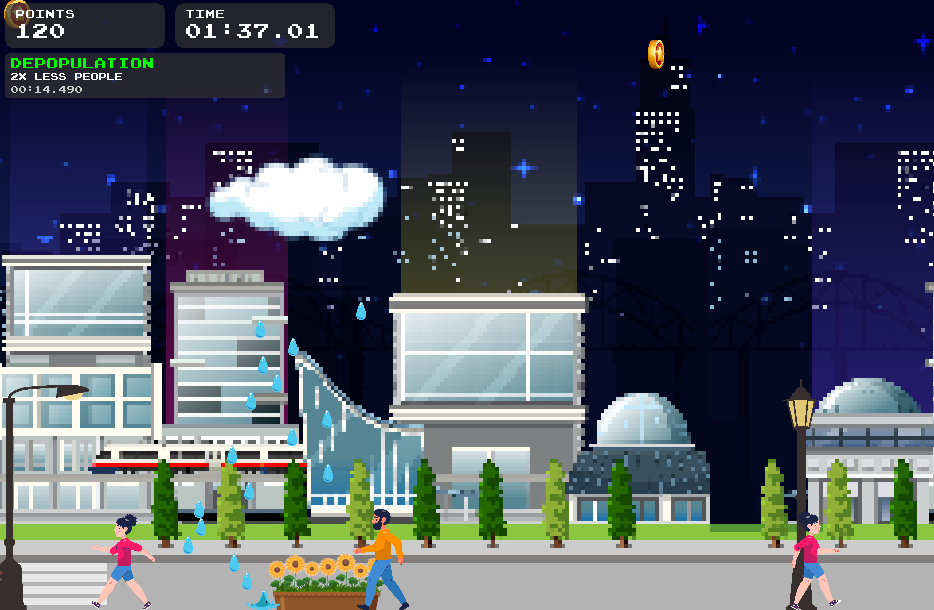
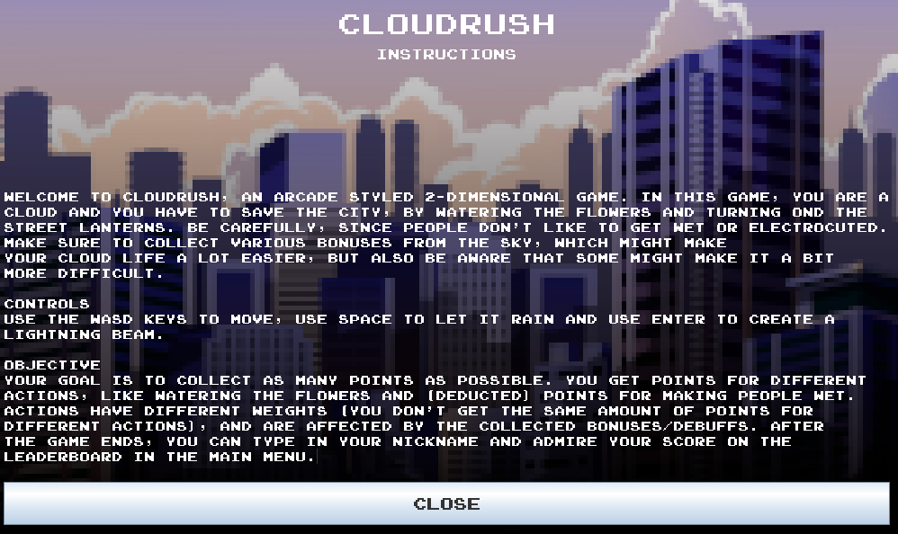

# CloudRush

Two-dimensional, arcade styled game created by [Kacper Golik](https://github.com/kaprog) & [Robin-Sch](https://github.com/Robin-Sch).

## Description
In this game, you are a cloud, which can generate rain and lightnings. 
You're going through various cities, filled with people, flowers and street lanterns.
With the rain you can water the flowers, but also make people get wet.
By striking lightning on street lanterns, you can turn them on and/or off, but if you miss, you might hit and electrocute a pedestrian.
During the game, there will appear various bonuses/debuffs in the sky, which can be collected to uncover their positive (or negative!) effect.

## Objective
Your goal is to collect as many points as possible.
You get points for different actions, like watering the flowers and (deducted) points for making people wet.
Actions have different weights, so you don't get the same amount of points for a different action.
Those weights are also affected by the collected bonuses/debuffs, so make sure to collect those too.
After the game ends, you can type in your nickname and admire your score on the leaderboard in the main menu.

## Controls
Use the WASD keys to move, use Space to let it rain and use Enter to create a lightning beam.

## Testing
To run the game you can either execute `CloudRush.jar` (by just clicking on it or from a terminal using `java -jar CloudRush.jar`) 
or use the following terminal command (with `CloudRush/src` as working directory) to run the game from source: `javac MainWindow.java && java -classpath ./:../resources/ MainWindow`.  
It's the best/easiest to test the level Eindhoven (easy).
We set the game duration for that level to 1 minute, so you don't have to  waste your time on the whole level just to fill in your nickname for the leaderboard.

## Screenshots

## Credits
During development of this game various free/open-source resources have been used:
- [City skyline landmarks illustration](https://www.freepik.com/free-vector/city-skyline-landmarks-illustration_11852626.htm) by Freepik
- [Cartoon city landscape night view](https://www.freepik.com/free-vector/cartoon-city-landscape-night-view_16691895.htm) by pikisuperstar on Freepik
- [City building view at night](https://www.freepik.com/free-vector/city-building-view-night_26163256.htm) by brgfx on Freepik
- [Flat clouds collection](https://www.freepik.com/free-vector/flat-clouds-collection_16133880.htm) by Freepik
- [Organic flat element animation frames](https://www.freepik.com/free-vector/organic-flat-element-animation-frames_13718763.htm) by Freepik
- [Beautiful flowers in clay pots on white background](https://www.freepik.com/free-vector/beautiful-flowers-clay-pots-white-background_8219299.htm) by brgfx on Freepik
- [A set of gold, silver and bronze coins. isolated](https://www.freepik.com/free-vector/set-gold-silver-bronze-coins-isolated_14877887.htm) by DrawingMyDiary on Freepik
- [Set of yellow lightning electric thunderbolt strike during night storm...](https://www.freepik.com/free-vector/set-yellow-lightning-electric-thunderbolt-strike-during-night-storm-powerful-electrical-discharge-impact-crack-magical-energy-flash-realistic-3d-vector-bolts-isolated-black-background_25581876.htm) by upklyak on Freepik
- [Urban objects](https://www.freepik.com/free-vector/urban-objects_811160.htm) by Freepik
- [Cartoon character animation frames set](https://www.freepik.com/free-vector/cartoon-character-animation-frames-set_13862440.htm) by Freepik
- [Cartoon character animation frames set](https://www.freepik.com/free-vector/cartoon-character-animation-frames-set_13862496.htm) by Freepik
- [Circle badge with star turn around](https://www.freepik.com/free-vector/circle-badge-with-star-turn-around_35514073.htm) by upklyak on Freepik
- Sound effects from [Mixkit](https://mixkit.co) and [Zapsplat](https://www.zapsplat.com)
